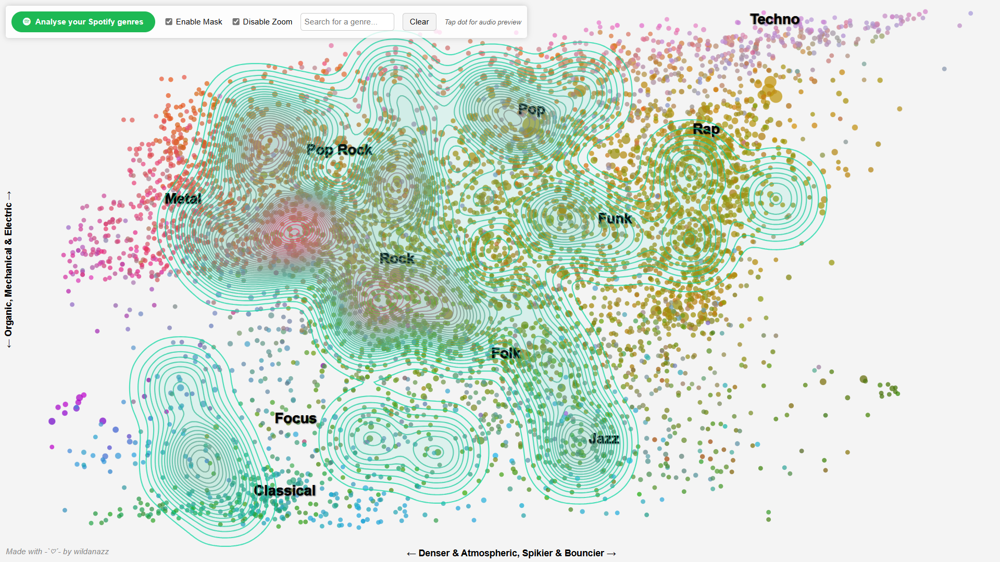

# D3 Spotify Genres

A web-based visualization tool that uses D3.js to showcase Spotify listening history by analyzing and categorizing favorite music genres.



## Features

- Fetches and processes user data via the Spotify Web API.
- Dynamically generates interactive genre-based visualizations using D3.js.
- Provides insights into user listening preferences.
- Easy-to-use interface for authentication and data exploration.

## Installation

### Prerequisites

- [Node.js](https://nodejs.org/) installed on your system.
- [Spotify Developer Account](https://developer.spotify.com/) to obtain your client ID and client secret.

### Steps

1. Clone the repository:

   ```bash
   git clone https://github.com/wildanazz/d3-spotify-genres.git
   cd d3-spotify-genres
   ```

2. Install the required dependencies:

   ```bash
   npm install
   ```

3. Add your Spotify **Client ID** to the `scripts/env.js` file. This is required to authenticate with the Spotify Web API.

4. Start the development server:

   ```bash
   npm start
   ```

## Technologies Used

- **Frontend**: D3.js, HTML, CSS, JavaScript
- **Backend**: Node.js, Express
- **API**: Spotify Web API

## Todo

- Optimize performance (e.g. efficient plot redrawing).

## Acknowledgements

- Special thanks to [Genre Map Explorer for Spotify](https://observablehq.com/@mjbo/genre-map-explorer-for-spotify) for the inspiration behind this project. Max's work provided great insights and ideas that helped shape this project.
- This project uses the music genre data and visualizations from [Every Noise at Once](https://everynoise.com/), a comprehensive resource that categorizes and maps musical genres created by Stephen R.
- [Spotify Web API](https://developer.spotify.com/documentation/web-api/) for providing access to spotify music data.
- [D3.js](https://d3js.org/) for creating dynamic and interactive visualizations in this project.
- Contributors who have provided valuable feedback and improvements.
